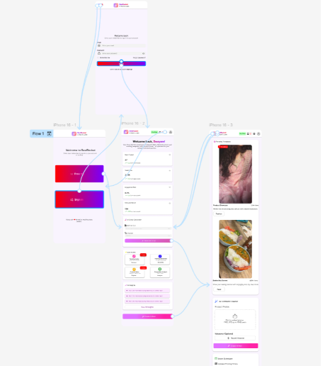

# ReelRocket

**AI Reel Co-Pilot for creators and solopreneurs**  
Generate trend-aligned Instagram Reels—scripts, edits, captions, and scheduling—in minutes, not hours.

**Who this is for**
- Micro-creators, freelancers, and solopreneurs
- Teams building or evaluating AI-first content workflows
- Developers exploring GPT-5.2–aligned prompt orchestration and media automation

---

## What ReelRocket Does

ReelRocket is an AI-first workflow that removes the two biggest bottlenecks in short-form video creation:

1. **Creative bottleneck** — deciding *what* to post.
2. **Execution bottleneck** — editing, syncing, captioning, and publishing.

It combines script generation, trend suggestions, auto-editing, captions, voiceovers, and scheduling into a single, disciplined pipeline.

### What It Explicitly Does NOT Do

- ❌ Replace creative judgment or personal branding
- ❌ Guarantee virality or engagement outcomes
- ❌ Act as a general-purpose video editor
- ❌ Scrape or bypass platform terms
- ❌ Optimize for long-form video content

This project is intentionally scoped to **short-form Reels workflows only**.

---

## Core Features

- AI script generation (hook → value → CTA)
- Trend-aligned audio and template suggestions
- Auto-sync images/videos to music beats
- Automated captions and subtitles
- Optional text-to-speech voiceovers
- Optimal posting time recommendations
- In-app scheduling for Instagram Reels

All features are designed for **speed, consistency, and low cognitive load**.



---

## Getting Started

reelrocket/
├── apps/
│   ├── web/            # Frontend (mobile-first)
│   └── api/            # Backend API
├── services/
│   ├── ai/             # Prompting & generation logic
│   ├── media/          # Video/audio processing
│   └── scheduling/     # Publishing & queues
├── config/
│   └── defaults.ts
├── docs/
│   └── architecture.md
└── README.md


### Prerequisites
- Node.js 18+ (or equivalent runtime)
- FFmpeg installed locally
- API access for:
  - LLM (GPT-5.2 compatible)
  - Media processing
  - Instagram Graph API (for scheduling)

### Installation

```bash
git clone https://github.com/your-org/reelrocket.git
cd reelrocket
npm install
# reelrocket-ai-product-case-study
# reelrocket-ai-product-case-study
# reelrocket-ai-product-case-study
